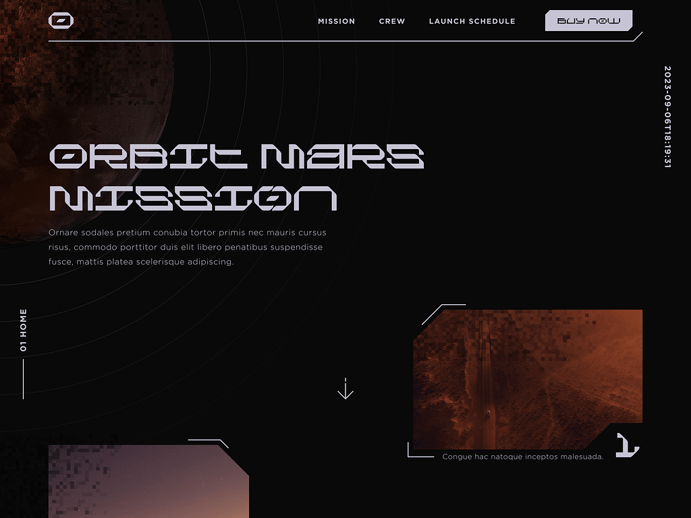
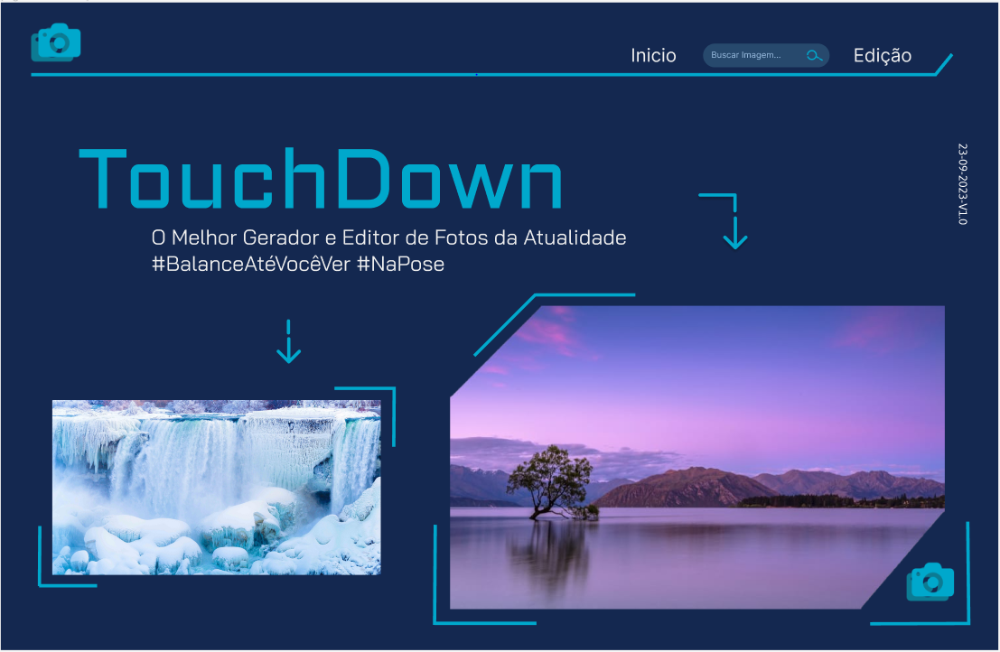
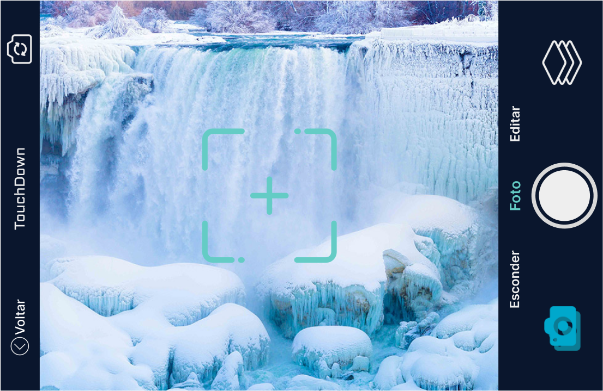
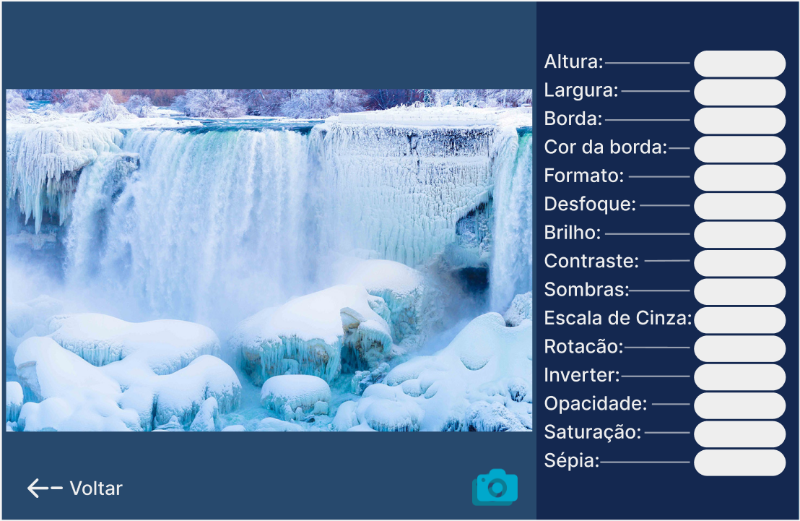

# TouchDown

Processo de aprendizagem-FrontEnd
   
  27/07/2023-15/12/2023

<a href="https://pixabay.com/api/docs/#api_search_images">Api escolhida </a>
<a href="https://dribbble.com/shots/22497341-Mars-Mission-Homepage">Imagem base retirada do site Dribble, feito por
    Adrian Fahrbach</a>>

<a href="https://www.figma.com/proto/MTDSYvf6tZkCgcr7yvLPKZ/TouchDown?type=design&node-id=55-137&t=W0niMtK0OkReC4oq-0&scaling=scale-down&page-id=0%3A1">Página de inicio feita no figma</a>

<a href="https://www.figma.com/proto/MTDSYvf6tZkCgcr7yvLPKZ/TouchDown?type=design&node-id=55-137&t=W0niMtK0OkReC4oq-0&scaling=scale-down&page-id=0%3A1">Página do gerador de fotos</a>

<a href="https://www.figma.com/proto/MTDSYvf6tZkCgcr7yvLPKZ/TouchDown?type=design&node-id=55-137&t=W0niMtK0OkReC4oq-0&scaling=scale-down&page-id=0%3A1">Página de edição da foto selecionada(função ainda não implementada)</a>

